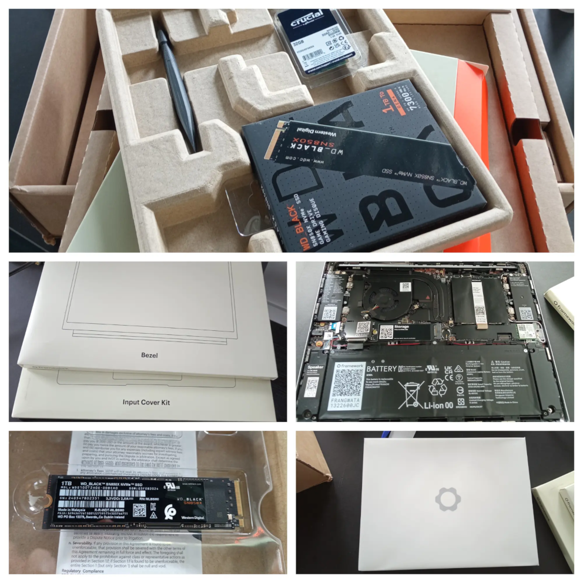
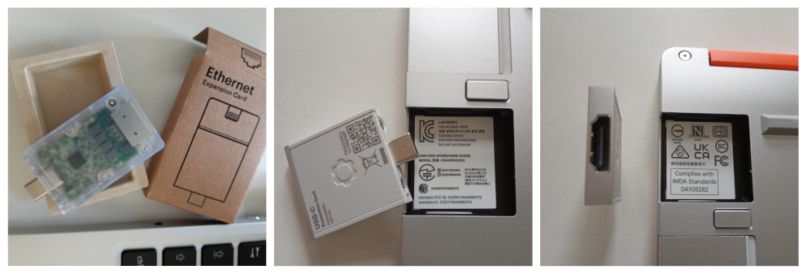
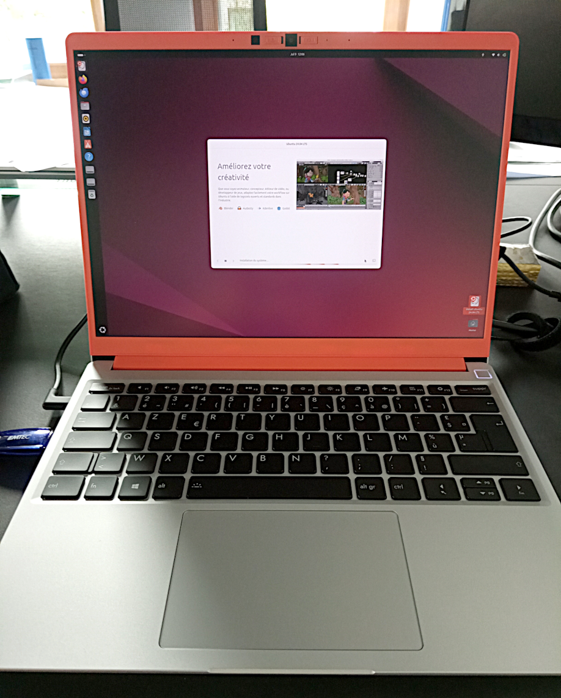

Mon arrivée dans une nouvelle aventure !

<!-- truncate -->

Lundi ! Arrivée dans les locaux, je suis accueilli par Flavien et Océane. Un bureau m'attend avec quelques goodies estampillés au couleur de l'entreprise, gourde, sweat, sticker et un petit mot d'accueil qui me font très plaisir. 

On commence par gérer tout ce que tout le monde « adore »… la partie administrative et tous les divers documents à fournir et quelques validations d’identité habituelles. On active mes accès à [Ekip](https://www.ekip.app/) ainsi je découvre les tickets restaurants écoresponsables. Puis avec Océane on passe en revue les accès aux outils qui permettent le suivi pour mes futures missions.

On reparle avec tous le monde de ce l’on veut construire à l’avenir et des impacts que veut avoir [Zatsit](https://zatsit.fr/) sur les aspects sociétal et environnemental ce qui m’amène à vous parler d’un choix sur le matériel qu’a fait la société...  

## Maintenant le plus cool : mon poste de travail...

Peu de temps avant mon arrivée, j’ai reçu un message qui me demandait de faire le choix de mon futur poste de travail, ainsi j’ai découvert le concept de [Framework](https://frame.work/fr/fr) ce qui permet à Zatsit pour être cohérent dans sa politique environnementale et avoir un impact le plus restreint possible sur la planête. J’ai donc choisi les différents éléments de ma machine 13 pouces avec coque en aluminium : processeur, ram, disque, extensions… Et pour le fun en DIY (Do It Yourself).

Donc tout était là, un carton contenant les diverses parties de mon ordinateur, quand on l’habitude de monter des configurations et comme tout est suffisamment indiqué sur la carte mère, on installe le disque SSD, la mémoire on referme avec le couvercle qui est le clavier, on serre quelque vis avec l’outil qui est fournit, quelques minutes suffises. Le petit truc sympa, le contour de l’écran est amovible et il existe plusieurs couleurs, moi j’ai choisi orange.

Pour pouvoir alimenter la machine et la connecter à divers équipements extérieurs, il y a 4 emplacements qui peuvent recevoir des modules d’extension en tous genres : USB type A ou C, HDMI, Ethernet et autres que l'on peut interchangé à chaud. Et la aussi on peut y ajouter un peu de couleur.

Une fois tout en place, j’ai installé une distribution Linux (Ubuntu 24.04) à partir d’une clé USB que j’avais préparé en avance en suivant les indications fournies sur le site du fabriquant. Et tout était fonctionnel au premier démarrage ! J’ai commencé à travailler sur ce poste après avoir configuré un environnent de développement. Je suis enthousiaste à l’idée d'utiliser ma machine lors de mes missions.

En parcourant le site de Framework [Framework](https://frame.work/fr/fr) on y découvre que beaucoup de matériaux constituant les postes de travail sont en bonne partie recyclé. Qu’il est aussi possible de commander tous les composants séparément ce qui permet de réparer ou de faire évoluer sa configuration facilement. Idée que je trouve intéressante quand on à déjà ouvert un ordinateur portable et de constater que l’on ne pourra pas faire grand chose pour se dépanner.

Il reste juste à voir dans le temps comment tout cela va évoluer et peut-être partager mon expérience dans quelques temps sur ce genre de machine. 

