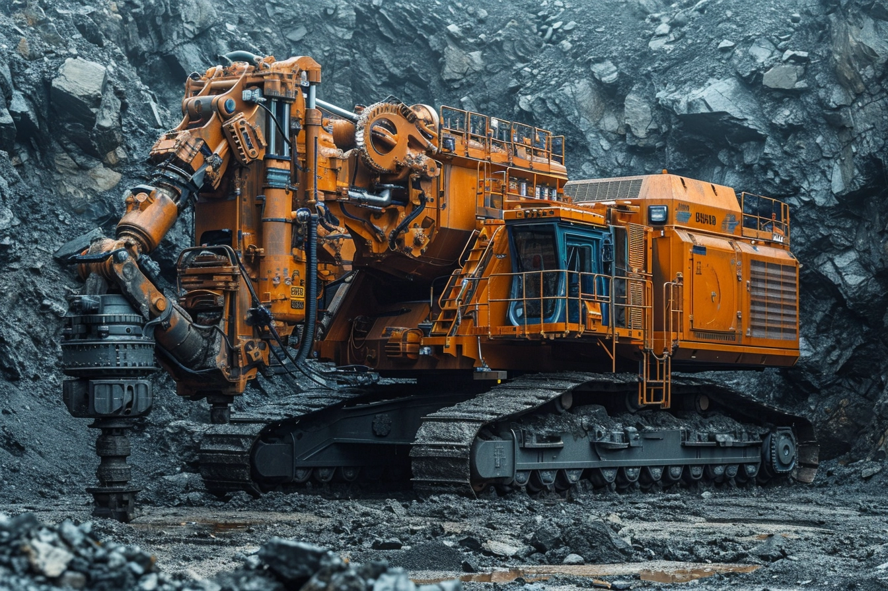

Le printemps 2024 est erminé (si vous l'avez vu passé) et nous voyons clairement que nous commençons à manquer de prénoms pour les tempêtes,
que les normales de saisons ne sont plus vraiment normales, que la sécheresse ou à l'inverse 
les innondations sont importantes et plus seulement au bout du monde, mais au plus près de nous.
L'empreinte de l'industrialisation est avérée dans l'augmentation, des gaz à effet de serre, mais l'empreinte liée aux matières 
premières nécessaires à cette industrialisation et à ses produits finis l'est moins.
Entre les deux, il y a bien sûr la consommation énergétique liée à l'extraction, la fabrication, la distribution et l'utilisation.

Je vous propose une série d'article consacrée aux impacts du numérique sur notre environnement et nous commencençons par une des sources : les matières premières, surtout les métaux.

<!-- truncate -->

## Mine de rien, ça en fait des cailloux !

Nous pourrions prendre d'autres produits de la vie courante pour illustrer les propos, mais nous nous interessons ici au numérique.
Ces dernières décénnies, il y a eu énormément de progrès dans les domaines de l'informatique, de l'électronique, de l'optique et pas
mal d'autres choses en "ique". Ces innovations ont nécessité toujours plus de matériaux, différents, plus rares les uns que les autres et disons le, personne n'a encore eu l'idée de faire massivement mieux avec moins.

Il y a quelque temps j'ai eu la chance d'assister à deux évènements plein de pédagogie : 
- La conférence d'Aurore Stéphant aux APIdays (même si j'avais déjà vu certaines de ces interventions sur Youtube et notamment ses deux passages chez Thinkerview).
- Un Meetup Techrocks en début d'année sur le sujet qui nous occupe.

### L'exploitation minière, toujours plus

À travers les différentes époques la demande en métaux n'a jamais cessé de croître, il y a pu avoir des ralentissements dûs à des évènements gépolotiques ou sanitaires (guerres, épidémies...), mais la demande est toujours croissante.

Plus nous avançons dans le temps et plus nous trouvons des propriétés intéressantes à des métaux et autres éléments et des applications à échelle industrielle. A tel point que nos smartphones en sont truffés, je vous invite à visiter cette [démo en ligne de Systext](https://www.systext.org/sites/all/animationreveal/mtxsmp/#/1) qui donne le résultat ci-dessous, avec pas moins de 60 éléments : 

Et oui, avec des composants comme l'Arsenic et l'Antimoine, certes en quantité minime et stabilisé dans votre smartphone, mais qu'en est-il de leur exploitation...

Le problème c'est que les métaux sont inégalement présents dans les sols et quand on trouve plus facilement du fer et de l'aluminium, il faudra dans le meilleur des cas extraire 1 tonne pour obtenir 1g d'or.

Il existe donc des mines qui sont spécialisées dans l'extraction d'un ou plusieurs éléments, mais là ou on va trouver un métal plus abondfmment par exemple, on va aussi en trouver plein d'autres.

Cette infographie nous explique que pour chaque élément au centre trouvé, on a de fortes chances de trouver les autres. Plus les autres éléments sont proches du centre, plus ils ont de chances d'être récupérés comme "co-produit", plus ils sont proches de l'extérieur et plus ils ont de risques d'être rejetés dans les "déchets miniers"

Pour extraire des métaux de la roche, il y a des procédés mécaniques, thermiques, chimiques pour par exemple partir de la roche et obtenir des catodes de cuivres. Tout celà avec une consommation d'eau et d'énergie phénoménale.

## Il faut creuser un gros trou ?

Vous avez peut-être déjà vu les [photographies de Dillon Marsh](https://dillonmarsh.com/fwiw.html) qui montre "à l'échelle" la taille des mines, versus ce qui en est extrait.

Ci-dessous, on peut se rendre compte, avec la représentation de la tour Eiffel, de la taille d'un site (extraction + exploitation + emprise en surface des déchets) pour la "mine de cuivre" de Palabora

Située en Afrique du Sud, cette mine a été exploitée pendant presque 40 ans [plus de détail sur cette mine avec ce lien](https://planet-terre.ens-lyon.fr/ressource/Img784-2023-06-05.xml).
D'autres exemples de mines gigantesques existent (cette fois c'est du charbon, mais ça symbolise bien l'extraction minière), plus proche de nous, comme la [mine de Hambach en Allemagne](https://fr.wikipedia.org/wiki/Mine_de_Hambach#)

## Quelles conséquences l'exploitation minière ?

La conséquence principale de cette exploitation est bien entendu d'approvisionner toutes nos industries : transports, énergie, armement, agriculture... enfin tout ce qui nécessite aujourd'hui des métaux, c'est à dire à peu prés tout, dans sa composition,sa construction ou sa logistique. Faites l'exercice : "Quel artefact utilisez-vous dans votre quotidien qui n’est pas dépendant de l’industrie minière dans sa fabrication, sa vente, son transport ?"

Conséquences écologiques.
conséquences politiques et sociales, parler de fairphone et des mines de Cobalt...

## Quelles solutions pour diminuer l'impact ?
Ne soyons pas pessimistes sur la capacité de l'Homme à trouver des solutions, mais nous passerons forcément à une diminution de l'usage des métaux. D'abord, parce que la teneur en métaux baissent dans les exploitations (même si on trouvera toujours de nouvelles mines) et ensuite parceque ça coutera toujours plus d'énergie, qui est elle aussi n'est pas inépuisable ?

Alors à l'échelle du numérique, que pouvons-nous faire ? Se poser les bonnes questions sur les usages toujours plus gourmands en ressources, concevoir mieux pour utiliser plus longtemps.

### Ressources : 
- [USI 2022 "Ruée minière au XXIè siècle : jusqu'où les limites seront-elles repoussées ?"](https://www.youtube.com/watch?v=i8RMX8ODWQs)
- [Compléments de sources d'entretien ](https://www.systext.org/sites/default/files/RP_SystExt_Thinkerview-2-Sources-Complements_Mai2023.pdf)
- [Rapport Tome 2 · Meilleures pratiques et mine « responsable »](https://www.systext.org/sites/default/files/RP_SystExt_Controverses-Mine_VOLET-2_Tome-2.pdf)
- [Reesources mnières en France](https://www.mineralinfo.fr/fr/ressources-minerales-france-gestion/mines-france)
- [By-product metals are technologically essential but have problematic supply](https://www.science.org/doi/10.1126/sciadv.1400180)

